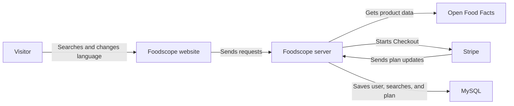

# Foodscope

Foodscope is a small website for finding packaged food products. It gets product data from Open Food Facts and shows the name, brand, and image to everyone. Nutrition details are shown only when the demo user has an active Stripe test subscription.

The website supports English, Dutch, German, and French.

## What the app can do

- Search for packaged food by product name or search words.
- Show clear messages when product details are missing.
- Change the website language by hand.
- Show product names in the chosen language when Open Food Facts has them.
- Save recent searches for one demo user in MySQL.
- Start a monthly Stripe test subscription through Stripe Checkout.
- Check Stripe webhooks before changing subscription access.
- Keep nutrition details hidden unless the backend confirms an active subscription.

## Architecture

<!-- mermaid:id=foodscope_architecture -->


The browser talks to the Express server. The server then talks to Open Food Facts, Stripe, and MySQL. This keeps private keys away from the browser. The server also checks each Stripe update before it changes nutrition access.

## Tools used

- Frontend: TypeScript, Next.js, React, and Tailwind CSS
- Backend: TypeScript, Express, Prisma, and MySQL
- Product data: Open Food Facts
- Payments: Stripe Checkout and Stripe webhooks in test mode
- Tests: Vitest, Supertest, and React Testing Library

## Project folders

```text
foodscope/
|-- frontend/           # Website
|-- backend/
|   |-- prisma/         # Database setup and changes
|   |-- src/            # Server code
|   `-- tests/          # Server tests
|-- docker-compose.yml  # Local MySQL setup
|-- .env.example        # Example settings
`-- package.json        # Main commands
```

## What you need

- Node.js 24
- npm 10 or newer
- Docker with Compose
- A Stripe test account and the Stripe CLI if you want to try the payment flow

## Setup

```bash
git clone https://github.com/jlescarlan11/foodscope.git
cd foodscope
cp .env.example backend/.env
cp .env.example frontend/.env.local
docker compose up -d
npm install
npm run db:generate
npm run db:migrate
npm run db:seed
npm run dev
```

Before starting the backend, change `OPEN_FOOD_FACTS_USER_AGENT` in `backend/.env` so it has your app name, version, and a real contact email.

Open <http://localhost:3000> in your browser. The server runs at <http://localhost:4000>.

MySQL may take a few seconds to start the first time. You can check it with:

```bash
docker compose ps
```

## Settings

The `.env.example` file contains example values only. Do not put real private keys in Git.

| Setting | Used by | What it is for |
| --- | --- | --- |
| `DATABASE_URL` | Backend | MySQL connection |
| `PORT` | Backend | Server port |
| `HOST` | Backend | Server address |
| `FRONTEND_URL` | Backend | Allowed website address and Stripe return page |
| `NEXT_PUBLIC_API_URL` | Frontend | Express server address |
| `STRIPE_SECRET_KEY` | Backend | Stripe test key |
| `STRIPE_WEBHOOK_SECRET` | Backend | Stripe webhook signing secret |
| `STRIPE_PRICE_ID` | Backend | Monthly Stripe Price ID |
| `OPEN_FOOD_FACTS_USER_AGENT` | Backend | App name, version, and contact for Open Food Facts |

The app will start without Stripe when all three Stripe settings are empty. When you use the main `npm run dev` command, add the Stripe test key and Price ID. The Stripe CLI will give the backend a local webhook secret. If you run the backend by itself or put it online, you must set the webhook secret yourself. Live Stripe keys are not accepted because this project is for test mode only.

## Stripe test setup

1. Create a product and a monthly price in Stripe test mode.
2. Add the test key and Price ID to `backend/.env`.
3. Install the Stripe CLI.
4. Run `npm run dev`. The project will start the Stripe listener and send webhooks to the local server.
5. Select **Unlock nutrition** in the app.
6. Use Stripe's test card `4242 4242 4242 4242` with any future date and any CVC.

Finishing Stripe Checkout does not unlock nutrition by itself. The backend waits for a signed Stripe webhook, saves the subscription state in MySQL, and then allows access.

Users with an active test subscription can ask to cancel at the end of the paid month. They keep nutrition access until that date. They can also keep the subscription before the date arrives.

For a real paid service, tax rules would need to be checked before turning on Stripe Tax.

## Languages

The language menu supports:

- English (`en`)
- Dutch (`nl`)
- German (`de`)
- French (`fr`)

The app's own text is translated for all four languages. Each search sends the chosen language to the backend. Product names are shown in this order:

```text
Name in the chosen language
-> General product name
-> "Unavailable" in the chosen language
```

Open Food Facts does not have every product in every language, so the app uses the best available name. Choosing a recent search also restores the language used for that search.

## Database

The database stores:

- One demo user
- Recent searches
- Stripe customer and subscription details
- Stripe event IDs, so the same webhook is not handled twice

The demo user ID is `00000000-0000-4000-8000-000000000001`. There is no sign-up or login page.

Useful database commands:

```bash
npm run db:generate
npm run db:migrate
npm run db:seed
```

## Tests and checks

Run these commands before review:

```bash
npm test
npm run typecheck
npm run lint
npm run build
```

The tests cover product searches, missing data, language changes, recent searches, Stripe Checkout, signed webhooks, subscription access, and error cases. Outside services are replaced with test versions during the normal test run.

GitHub Actions runs the same checks. It also starts a clean MySQL database, runs every Prisma migration, and checks the database work.

## Main choices

- Product records are not saved in MySQL. Open Food Facts stays as the source of product data.
- Only recent searches and account details are saved.
- Similar recent searches in the same language are kept as one item and moved to the top.
- Product data is cleaned before it is sent to the browser.
- Missing names, brands, images, and nutrition values are shown as unavailable instead of breaking the page.
- Nutrition details are removed by the backend when the subscription is not active.
- Stripe changes are accepted only from signed webhooks.
- Private keys stay in environment settings and are never sent to the browser.
- Product search results are kept for 10 minutes to avoid asking Open Food Facts for the same data too often.
- Requests have size and time limits so they do not stay open forever.

## Known limits

- There is only one demo user.
- Stripe works in test mode only.
- Open Food Facts data may be missing or wrong because it is added by its community.
- Product translations depend on what Open Food Facts has for each item.
- Only the eight latest recent searches are shown.
- The product search cache belongs to one running backend. Restarting the backend clears it.
- Rate limits are kept by each running backend, not shared across many servers.
- Tax is not turned on.
- There is no full account page or Stripe Customer Portal.

## Quick review

1. Follow the setup steps and open the website.
2. Search for `oat milk`.
3. Change between English, Dutch, German, and French.
4. Select a recent search and check that its language returns.
5. Check that nutrition is locked without a subscription.
6. Complete Stripe Checkout in test mode.
7. Wait for the webhook, then search again and check that nutrition is shown.
8. Try scheduling and stopping a subscription cancellation.
9. Run the four test and build commands above.
